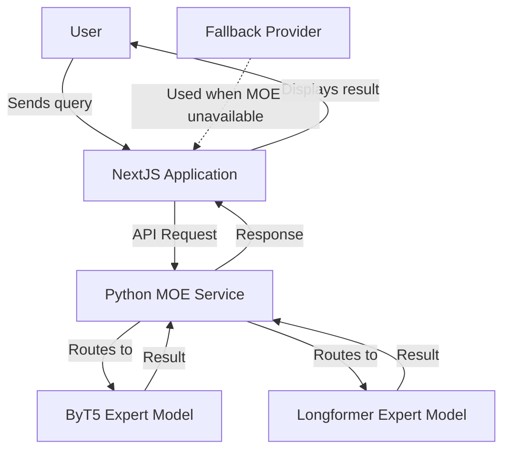
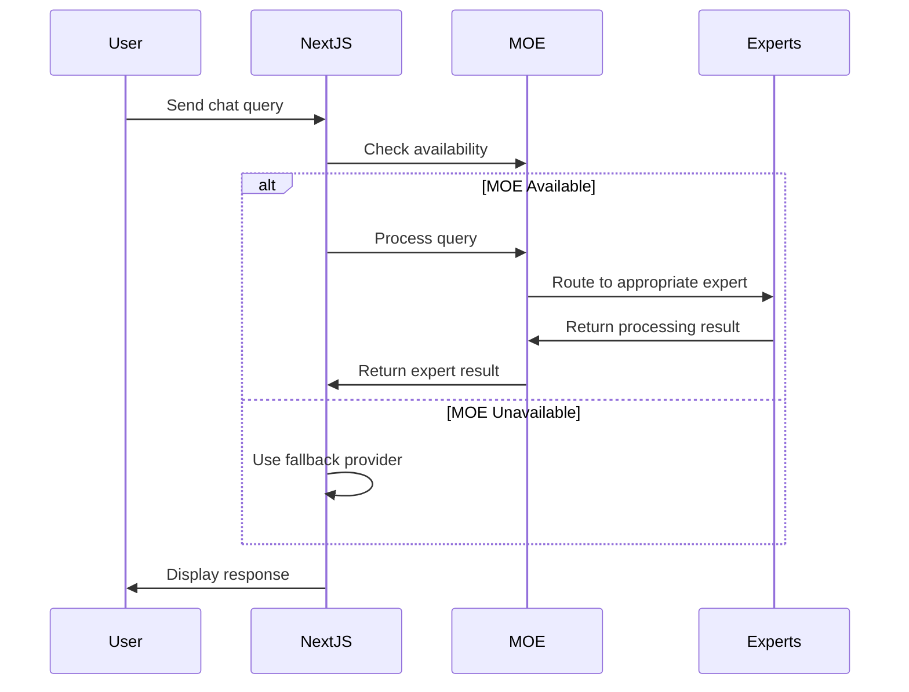
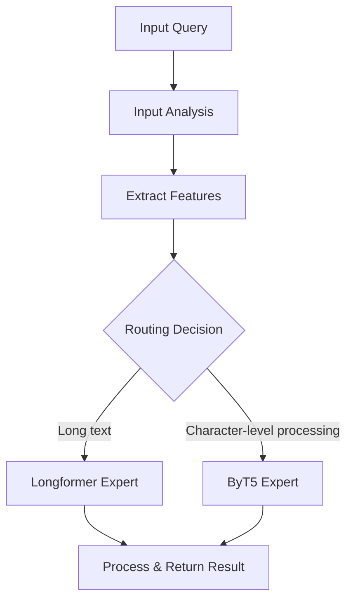
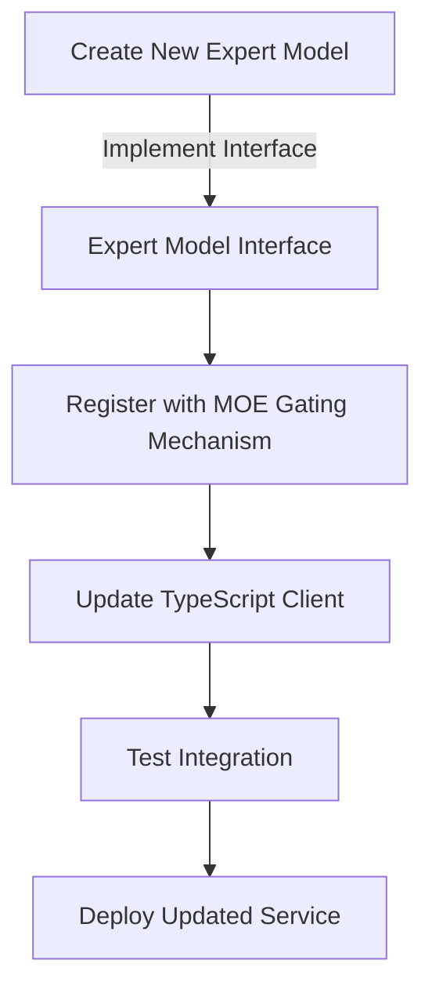

# MOE AI Experts Integration Documentation

## Table of Contents

- [1. Overview of the MOE Integration](#1-overview-of-the-moe-integration)
  - [1.1 What Was Implemented](#11-what-was-implemented)
  - [1.2 Python-NextJS Connection Architecture](#12-python-nextjs-connection-architecture)
  - [1.3 Available MOE Expert Models](#13-available-moe-expert-models)
- [2. User Guide for Utilizing MOE Models](#2-user-guide-for-utilizing-moe-models)
  - [2.1 Selecting Different MOE Models in the Chat Interface](#21-selecting-different-moe-models-in-the-chat-interface)
  - [2.2 Query Recommendations by Expert Type](#22-query-recommendations-by-expert-type)
    - [2.2.1 ByT5 Expert: Best Use Cases and Examples](#221-byt5-expert-best-use-cases-and-examples)
    - [2.2.2 Longformer Expert: Best Use Cases and Examples](#222-longformer-expert-best-use-cases-and-examples)
    - [2.2.3 Auto-routing: When to Use and How It Works](#223-auto-routing-when-to-use-and-how-it-works)
  - [2.3 Performance Considerations](#23-performance-considerations)
- [3. Technical Documentation](#3-technical-documentation)
  - [3.1 Architecture Diagram](#31-architecture-diagram)
  - [3.2 Configuration Requirements](#32-configuration-requirements)
  - [3.3 Deployment Instructions for Vercel](#33-deployment-instructions-for-vercel)
  - [3.4 Bug Fixes Implemented](#34-bug-fixes-implemented)
  - [3.5 Monitoring and Troubleshooting](#35-monitoring-and-troubleshooting)
  - [3.6 Extending with Custom Expert Models](#36-extending-with-custom-expert-models)
- [4. Future Enhancements and Roadmap](#4-future-enhancements-and-roadmap)
  - [4.1 Planned Expert Models](#41-planned-expert-models)
  - [4.2 Performance Improvements](#42-performance-improvements)
  - [4.3 Scalability Enhancements](#43-scalability-enhancements)
  - [4.4 Feature Roadmap](#44-feature-roadmap)

## 1. Overview of the MOE Integration

### 1.1 What Was Implemented

The Mixture of Experts (MOE) integration is a sophisticated AI system that enhances the existing chat application by incorporating specialized AI expert models. This approach represents a significant advancement over traditional single-model architectures, providing several key benefits:

- **Specialized Processing**: Each expert model excels at specific types of tasks or content
- **Dynamic Routing**: Intelligently directs queries to the most appropriate expert
- **Improved Response Quality**: Leverages the strengths of each expert model
- **Resource Efficiency**: Routes complex queries to more powerful models while using lightweight models for simpler queries

The implementation consists of two main components:

1. **Python MOE Service**: A FastAPI-based backend that hosts the expert models and provides routing intelligence
2. **NextJS Integration**: TypeScript client that connects the chat application to the MOE service

The system includes a robust fallback mechanism to ensure uninterrupted service, automatically defaulting to standard chat models when the MOE service is unavailable.

### 1.2 Python-NextJS Connection Architecture

The MOE integration follows a service-oriented architecture where the Python MOE service and NextJS application communicate through RESTful API endpoints. Here's how the connection works:

**FastAPI MOE Service**:
- Exposes endpoints for processing text, checking health status, and synchronous processing
- Hosts the expert models (ByT5 and Longformer)
- Contains the routing logic to select the appropriate expert model
- Provides standardized response formats with expert information

**TypeScript Client Integration**:
- Implements a provider in `lib/ai/providers/moe.ts` that communicates with the MOE service
- Wraps the MOE functionality to integrate with the app's existing provider system
- Handles error states and fallback to default models
- Monitors service health and availability

**API Communication Flow**:
1. User sends a query through the NextJS application
2. The application's MOE provider checks service availability via `/health` endpoint
3. If available, the query is sent to the MOE service via `/process/sync` endpoint
4. The MOE service routes to the appropriate expert model and processes the query
5. Results are returned in JSON format with metadata about the process
6. The NextJS application presents the results to the user

**Data Exchange Format**:
```typescript
// Request format
interface MOERequestOptions {
  task?: string;
  options?: Record<string, any>;
}

// Response format
interface MOEResponse {
  result: string;
  expert_used: string;
  confidence: number;
  processing_time: number;
  input_features?: Record<string, number>;
}
```

The architecture includes robust error handling and fallback mechanisms to ensure seamless operation even when the MOE service is unavailable.

### 1.3 Available MOE Expert Models

The MOE integration currently includes two specialized expert models plus an auto-routing capability:

**1. ByT5 Expert**
- **Description**: Character-level transformer model specialized in processing text at a byte level
- **Strengths**: Excels at handling specialized text, code snippets, text with special characters, and shorter content
- **Processing Approach**: Performs token-free processing by working directly with raw bytes/characters
- **Model ID**: `moe-expert-byt5`

**2. Longformer Expert**
- **Description**: Specialized transformer model designed for processing long documents
- **Strengths**: Excels at understanding long-form content with complex context across paragraphs
- **Processing Approach**: Uses an attention mechanism optimized for long documents
- **Model ID**: `moe-expert-longformer`

**3. Auto-routing Capability**
- **Description**: Intelligent system that automatically selects the most appropriate expert model
- **Processing Approach**: Analyzes input characteristics (length, complexity, special characters) to make routing decisions
- **Benefits**: Simplifies user experience by removing the need to manually select the right expert
- **Model ID**: `moe-auto`

Each model is accessible through the model selector in the chat interface and provides specialized processing capabilities for different types of queries.

## 2. User Guide for Utilizing MOE Models

### 2.1 Selecting Different MOE Models in the Chat Interface

The MOE integration adds three new model options to the chat interface's model selector. Here's how to select and use them:

1. **Accessing the Model Selector**:
   - Start a new chat or open an existing conversation
   - Look for the model selector dropdown in the chat interface (typically located near the message input area)
   - Click on the dropdown to see available models

2. **Available MOE Models**:
   - **MOE ByT5 Expert** (`moe-expert-byt5`): For specialized text processing
   - **MOE Longformer Expert** (`moe-expert-longformer`): For long document processing
   - **MOE Auto-Routing** (`moe-auto`): Automatically selects the best expert

3. **Selecting a Model**:
   - Click on your desired MOE model from the dropdown
   - The interface will indicate which model is currently selected
   - Enter your query and submit it for processing

4. **Understanding the Response**:
   - The system processes your query using the selected expert model
   - Responses include information about which expert was used (visible in developer tools)
   - Processing time and confidence scores are tracked internally

5. **Fallback Behavior**:
   - If the MOE service is unavailable, the system will automatically use the fallback chat model
   - A notification will appear indicating that the fallback model was used
   - You can continue using the chat with the fallback model without interruption

When a query is processed through an MOE model, the system makes the routing decision based on the query characteristics or uses the explicitly selected expert.

### 2.2 Query Recommendations by Expert Type

#### 2.2.1 ByT5 Expert: Best Use Cases and Examples

The ByT5 Expert model specializes in character-level processing and is particularly effective for specific types of content.

**Specialized for**:
- Short to medium-length text
- Character-level analysis
- Text with special characters, symbols, or unusual formatting
- Code snippets and programming syntax

**Ideal query examples**:

1. **Code snippet analysis**:
   ```
   What does this regex pattern do? ^[a-zA-Z0-9._%+-]+@[a-zA-Z0-9.-]+\.[a-zA-Z]{2,}$
   ```

2. **Text with unusual characters**:
   ```
   Analyze this product ID: XJ-2023/Ω§-556*
   ```

3. **Short specialized text**:
   ```
   Summarize the meaning of this error: 'TypeError: Cannot read property 'x' of undefined'
   ```

4. **Specific formatting needs**:
   ```
   Convert this markdown to HTML: # Header\n- Item 1\n- Item 2
   ```

5. **Character-level text transformations**:
   ```
   Create a ROT13 encryption of this text: "Hello World"
   ```

**When to choose ByT5 Expert**:
- When working with text that contains special characters or unusual formatting
- For shorter, more specialized text processing tasks
- When character-level understanding is important
- For code-related queries or syntax analysis
- When exact character preservation is critical

The ByT5 Expert generally provides faster responses for shorter texts compared to the Longformer model, making it ideal for quick, specialized processing tasks.

#### 2.2.2 Longformer Expert: Best Use Cases and Examples

The Longformer Expert model excels at processing long documents while maintaining context across paragraphs.

**Specialized for**:
- Long document processing
- Maintaining context across multiple paragraphs
- Complex analysis requiring understanding of document structure
- Tasks benefiting from global document context

**Ideal query examples**:

1. **Document analysis**:
   ```
   Analyze this legal contract and highlight the key obligations for both parties:
   [followed by multiple paragraphs of legal text]
   ```

2. **Extended comparisons**:
   ```
   Compare and contrast these two research methodologies in detail:
   [followed by lengthy descriptions of two different methodologies]
   ```

3. **Multi-step instructions**:
   ```
   I need a comprehensive plan for implementing a new CRM system with the following requirements:
   [followed by detailed requirements across multiple categories]
   ```

4. **Context-dependent questions**:
   ```
   Based on the following product documentation, what are the system requirements and how do they vary by use case?
   [followed by lengthy documentation]
   ```

5. **Document summarization**:
   ```
   Summarize the key points from this research paper while preserving the relationships between findings:
   [followed by lengthy research paper content]
   ```

**When to choose Longformer Expert**:
- When working with content longer than a few paragraphs
- For tasks requiring understanding of relationships between distant parts of text
- When the context spans across a large body of text
- For comprehensive analysis of structured documents
- When global document context matters for accurate responses

The Longformer Expert may take longer to process queries compared to ByT5, but it provides more coherent results for long documents by maintaining context across the entire input.

#### 2.2.3 Auto-routing: When to Use and How It Works

The Auto-routing capability automatically selects the most appropriate expert model based on input characteristics.

**How the selection works**:
- Analyzes the input text for various features:
  - Text length (number of characters and tokens)
  - Complexity measures (sentence structure, vocabulary diversity)
  - Character distribution (special characters, uppercase ratio)
  - Formatting patterns (code blocks, structured data)
- Uses a gating mechanism to route to the most appropriate expert
- Returns confidence score with the routing decision

**Ideal use cases**:

1. **General queries where the optimal expert isn't obvious**:
   ```
   Explain the difference between REST and GraphQL APIs and provide example code for each.
   ```
   This query contains both conceptual explanation and code elements, making the routing decision complex.

2. **Mixed inputs containing both specialized text and longer content**:
   ```
   I have the following error in my code: TypeError: Cannot read property 'data' of undefined. 
   Here's the full context of my application structure:
   [followed by lengthy application architecture description]
   ```
   This combines error analysis (ByT5 strength) with lengthy context (Longformer strength).

3. **First-time users unfamiliar with the different experts' strengths**:
   ```
   Can you help me understand how to implement a binary search algorithm?
   ```
   New users benefit from automatic routing to the appropriate expert.

4. **Evolving conversations that might switch between expert domains**:
   Initial query about code might evolve into discussion of system architecture, requiring different expertise.

**When to choose Auto-routing**:
- For everyday use when you're unsure which expert would provide the best response
- When your query contains elements that might benefit from different experts
- For exploratory conversations where topics might shift
- When you want the system to optimize the response quality automatically

Auto-routing provides the convenience of not having to manually select an expert while still benefiting from specialized processing. It's the recommended default choice for most users.

### 2.3 Performance Considerations

Understanding the performance characteristics of each MOE model helps in setting appropriate expectations and optimizing your experience.

**Processing Time Expectations**:

| Model | Short Queries (<100 words) | Medium Queries (100-500 words) | Long Queries (>500 words) |
|-------|----------------------------|--------------------------------|---------------------------|
| ByT5 Expert | 0.5-2 seconds | 2-5 seconds | 5-15 seconds |
| Longformer Expert | 1-3 seconds | 3-8 seconds | 8-25 seconds |
| Auto-routing | Depends on selected expert | Depends on selected expert | Depends on selected expert |

**Memory/Resource Usage**:
- ByT5 Expert: Lower memory footprint, efficient for shorter texts
- Longformer Expert: Higher memory usage, optimized for long documents
- Resource utilization scales with input length and complexity

**Handling Long-running Requests**:
- The system implements a timeout mechanism (default: 30 seconds)
- For queries exceeding the timeout, you'll receive a notification to:
  - Break down your query into smaller parts
  - Try at a less busy time
  - Use a different model if appropriate
- Progress indicators show when processing is occurring

**Fallback Behavior**:
- If the MOE service is unavailable, the system automatically falls back to the default chat model
- You'll see a notification: "The MOE service is currently unavailable. Your message has been processed using a fallback model instead."
- The fallback occurs seamlessly without requiring additional action
- Once the MOE service is restored, it will automatically be used for subsequent queries

**Performance Optimization Tips**:
1. **For faster responses**:
   - Use ByT5 for shorter, specialized queries
   - Break down long documents into conceptually complete chunks
   - Be specific and concise in your queries

2. **For better quality with long content**:
   - Use Longformer for comprehensive document analysis
   - Provide complete context rather than fragmented information
   - Structure multi-part questions clearly

3. **For optimal routing**:
   - When using auto-routing, put the most characteristic content first
   - Include clear indicators of content type (code blocks, document structure)
   - Consider splitting mixed content types into separate queries

The system is designed to provide the best possible response while managing resource constraints, with graceful degradation when necessary.

## 3. Technical Documentation

### 3.1 Architecture Diagram

The MOE integration follows a service-oriented architecture with clear separation between the NextJS frontend application and the Python MOE service.



**Key Components**:

1. **NextJS Application**:
   - Frontend chat interface
   - Model selection UI
   - TypeScript MOE provider (`lib/ai/providers/moe.ts`)
   - Integration with existing AI providers
   - Fallback mechanisms

2. **Python MOE Service**:
   - FastAPI-based service
   - Health check endpoint
   - Synchronous and asynchronous processing endpoints
   - Gating mechanism for expert selection
   - Input analysis and feature extraction

3. **Expert Models**:
   - ByT5 Expert: Character-level processing
   - Longformer Expert: Long document processing
   - Model optimization and caching

**Request/Response Flow**:



**MOE Routing Decision Flow**:



This architecture provides clear separation of concerns, allowing for independent scaling and maintenance of the MOE service and NextJS application.

### 3.2 Configuration Requirements

The MOE integration requires specific configuration parameters to connect the NextJS application with the Python MOE service.

**Required Configuration Parameters**:

1. **MOE_API_BASE_URL**:
   - Default value: `http://localhost:8000`
   - Location: `lib/ai/providers/moe.ts`
   - Purpose: Specifies the base URL for the MOE service
   - For production deployment: Update to the appropriate hostname/IP

2. **MOE_TIMEOUT_MS**:
   - Default value: `30000` (30 seconds)
   - Location: `lib/ai/providers/moe.ts`
   - Purpose: Sets the timeout for MOE API requests
   - Considerations: May need adjustment based on query complexity and server resources

**Additional Configuration Considerations**:

1. **Python MOE Service Configuration**:
   - Default port: `8000`
   - Host configuration: `0.0.0.0` (accepts connections from any IP)
   - CORS settings: Configured to allow cross-origin requests from any origin

2. **Model Selection in NextJS**:
   - Models are defined in `lib/ai/models.ts`
   - MOE models are integrated into the `myProvider` in `lib/ai/providers.ts`

3. **Deployment Environment Variables**:
   - For production deployment, consider using environment variables instead of hardcoded values
   - Example `.env` configuration:
     ```
     MOE_API_URL=https://moe-service.example.com
     MOE_TIMEOUT_MS=30000
     ```

4. **Fallback Configuration**:
   - The fallback provider is specified during MOE provider creation
   - Default fallback: `baseProviders['chat-model']`
   - Location: `lib/ai/providers.ts`

**Checking Configuration**:

To verify your configuration is correct, you can:
1. Use the health check endpoint: `GET {MOE_API_BASE_URL}/health`
2. Expected successful response:
   ```json
   {
     "status": "healthy",
     "models_loaded": true,
     "cuda_available": true,
     "device": "cuda"
   }
   ```

Proper configuration is essential for the MOE integration to function correctly. Always test the connection between the NextJS application and MOE service after any configuration changes.

### 3.3 Deployment Instructions for Vercel

Deploying the MOE integration to Vercel requires specific steps to ensure both the NextJS application and Python MOE service work correctly in production.

**Prerequisites**:

1. Vercel account and CLI installed
2. Git repository with your NextJS application
3. Server or cloud instance for the Python MOE service
4. Python 3.8+ and required packages installed

**Step 1: Deploy the Python MOE Service**

The Python MOE service needs to be deployed separately from the NextJS application:

1. **Prepare the server**:
   ```bash
   # Install required packages
   pip install fastapi uvicorn torch transformers
   pip install -r requirements.txt
   ```

2. **Deploy service files**:
   - Upload the MOE service files to your server
   - Ensure the following files are included:
     - `fastapi_moe_example.py` (main service file)
     - `moe_gating_mechanism.py`
     - `byt5_integration.py`
     - `longformer_integration.py`
     - `moe_optimizations.py`

3. **Run the service**:
   ```bash
   # For development
   python fastapi_moe_example.py
   
   # For production (using Gunicorn)
   gunicorn fastapi_moe_example:app -k uvicorn.workers.UvicornWorker -w 1 --bind 0.0.0.0:8000
   ```

4. **Set up reverse proxy (recommended)**:
   - Configure Nginx or Apache as a reverse proxy
   - Secure with SSL/TLS for production

**Step 2: Configure NextJS for Vercel Deployment**

1. **Update MOE API URL**:
   - Modify `lib/ai/providers/moe.ts` to use your production MOE service URL
   - Or preferably, use environment variables:
     ```typescript
     const MOE_API_BASE_URL = process.env.MOE_API_URL || 'http://localhost:8000';
     ```

2. **Ensure Edge Runtime compatibility**:
   - The chat API route uses Edge Runtime
   - Verify `export const runtime = 'edge';` is present in `app/(chat)/api/chat/route.ts`

3. **Update next.config.ts**:
   - Ensure environment variables are correctly configured:
     ```typescript
     env: {
       MOE_API_URL: process.env.MOE_API_URL,
     }
     ```

**Step 3: Deploy to Vercel**

1. **Push changes to Git**:
   ```bash
   git add .
   git commit -m "Configure for Vercel deployment"
   git push
   ```

2. **Deploy using Vercel CLI**:
   ```bash
   vercel
   ```

3. **Or deploy from the Vercel dashboard**:
   - Connect your Git repository
   - Configure build settings
   - Set environment variables

4. **Configure environment variables in Vercel**:
   - `MOE_API_URL`: Your MOE service URL (e.g., `https://moe-service.example.com`)
   - `MOE_TIMEOUT_MS`: Timeout in milliseconds (e.g., `30000`)

**Step 4: Verify Deployment**

1. **Test health check**:
   - Visit `https://your-app-url.vercel.app/api/healthcheck`
   - Verify the application is running correctly

2. **Test MOE integration**:
   - Open the chat interface
   - Select one of the MOE models
   - Send a test message
   - Verify the response comes from the expected expert model

**Troubleshooting Vercel Deployment**:

- If the MOE service is unreachable, verify network settings and firewall rules
- Check Vercel logs for any API connection errors
- Ensure the MOE service has sufficient resources to handle production load
- Verify that CORS settings allow requests from your Vercel domain

With these steps completed, your MOE integration should be successfully deployed and operational on Vercel.

### 3.4 Bug Fixes Implemented

Several critical issues were identified and resolved during the development and testing of the MOE integration. Understanding these fixes helps with troubleshooting and maintaining the system.

**1. Error Handling During MOE Service Outages**

*Issue*: When the MOE service was unavailable, the application would experience errors, leading to failed requests and degraded user experience.

*Fix Implemented*:
- Added service availability check via `/health` endpoint
- Implemented graceful fallback to default models when MOE is unavailable
- Added specific error messaging to inform users when fallback is used
- Code location: `lib/ai/providers/moe.ts` - `checkMOEAvailability()` function and error handling in `createMOEProvider()`

```typescript
// Example of fallback mechanism
if (!isMOEAvailable) {
  console.warn('MOE API unavailable, falling back to default provider');
  return { usedFallback: true };
}
```

**2. Timeout Handling for Long-running Requests**

*Issue*: Long-running MOE requests would sometimes exceed server timeouts, causing incomplete responses or hanging requests.

*Fix Implemented*:
- Added configurable timeout parameter (`MOE_TIMEOUT_MS`)
- Implemented AbortController for clean timeout handling
- Added clear error messaging for timeout scenarios
- Code location: `lib/ai/providers/moe.ts` - timeout handling in `processMOEText()`

```typescript
// Example of timeout implementation
const controller = new AbortController();
const timeoutId = setTimeout(() => controller.abort(), MOE_TIMEOUT_MS);
```

**3. Edge Runtime Compatibility**

*Issue*: The MOE integration initially had compatibility issues with Vercel Edge Runtime, affecting deployment.

*Fix Implemented*:
- Modified API route to explicitly use Edge Runtime
- Ensured streaming responses work correctly in Edge environment
- Added appropriate headers and response formats for Edge compatibility
- Code location: `app/(chat)/api/chat/route.ts` - `export const runtime = 'edge';`

**4. Database Connection Handling**

*Issue*: Multiple concurrent MOE requests could lead to database connection pool exhaustion.

*Fix Implemented*:
- Improved connection pooling configuration
- Added connection timeout handling and retries
- Implemented graceful error handling for database connection issues
- Code location: Various database-related files and error handling in API routes

**5. Memory Management for Large Requests**

*Issue*: Processing very large text inputs could lead to memory issues in the MOE service.

*Fix Implemented*:
- Added input size validation and limits
- Implemented chunking for large inputs where appropriate
- Optimized model loading and inference to reduce memory footprint
- Code location: Python MOE service implementation

**6. Race Conditions in Concurrent Requests**

*Issue*: Concurrent requests to the same MOE expert could sometimes lead to race conditions.

*Fix Implemented*:
- Added request queuing mechanism
- Implemented proper synchronization for shared resources
- Added unique request IDs for tracking and debugging
- Code location: Python MOE service implementation

These bug fixes significantly improved the reliability, performance, and user experience of the MOE integration. Future maintenance should be aware of these areas to prevent regression.

### 3.5 Monitoring and Troubleshooting

Effective monitoring and troubleshooting are essential for maintaining the MOE integration's reliability and performance. This section outlines the tools and approaches for monitoring the system and resolving common issues.

**Health Check Mechanisms**

1. **MOE Service Health Endpoint**:
   - Endpoint: `GET {MOE_API_BASE_URL}/health`
   - Expected response:
     ```json
     {
       "status": "healthy",
       "models_loaded": true,
       "cuda_available": true,
       "device": "cuda"
     }
     ```
   - Use this endpoint to verify the MOE service status

2. **NextJS Health Check**:
   - Endpoint: `GET /api/health`
   - Verifies the NextJS application is running correctly
   - Can be extended to include MOE availability status

**Logging and Error Monitoring**

1. **MOE Service Logs**:
   - Standard output/error logs from the Python service
   - Log levels: INFO, WARNING, ERROR, DEBUG
   - Key events logged:
     - Service startup and model loading
     - Routing decisions
     - Processing times
     - Error conditions

2. **NextJS Application Logs**:
   - Client-side console logs
   - Server-side logs in Vercel dashboard
   - Key events logged:
     - MOE service availability checks
     - Fallback to default providers
     - Request/response cycles
     - Error handling

3. **Recommended Monitoring Setup**:
   - Configure log aggregation (e.g., ELK stack, Datadog)
   - Set up alerts for critical errors
   - Monitor processing times for performance degradation

**Common Issues and Solutions**

1. **MOE Service Unavailability**:
   - *Symptoms*: Fallback provider being used, errors in MOE connections
   - *Checks*:
     - Verify MOE service is running: `curl {MOE_API_BASE_URL}/health`
     - Check network connectivity between NextJS and MOE service
     - Examine MOE service logs for errors
   - *Solution*:
     - Restart MOE service if needed
     - Check for resource constraints (memory, CPU)
     - Verify correct configuration

2. **Timeout Handling**:
   - *Symptoms*: Requests taking too long, timeout errors
   - *Checks*:
     - Monitor processing times in MOE service logs
     - Check resource utilization during processing
     - Verify timeout configuration
   - *Solution*:
     - Adjust `MOE_TIMEOUT_MS` if needed
     - Optimize expert models for faster inference
     - Implement caching for common queries

3. **Expert Model Loading Failures**:
   - *Symptoms*: MOE service reports unhealthy status, models not loaded
   - *Checks*:
     - Examine MOE service startup logs
     - Verify model files are present and accessible
     - Check for sufficient disk space and memory
   - *Solution*:
     - Reinstall model files if corrupted
     - Ensure sufficient resources for model loading
     - Check for compatible versions of dependencies

4. **Request Routing Problems**:
   - *Symptoms*: Queries routed to inappropriate experts
   - *Checks*:
     - Examine routing confidence scores
     - Check input features used for routing
     - Compare expected vs. actual expert selection
   - *Solution*:
     - Adjust routing thresholds if needed
     - Update feature extraction for better accuracy
     - Use explicit expert selection for critical queries

**Performance Monitoring**

1. **Key Metrics to Track**:
   - Request volume by expert model
   - Average processing time by expert
   - Fallback frequency
   - Error rates
   - Memory and CPU utilization

2. **Performance Dashboard**:
   - Consider implementing a dashboard showing:
     - Real-time MOE service status
     - Processing times trend
     - Expert model usage distribution
     - Error rates and types

**Service Recovery Procedures**

1. **MOE Service Restart**:
   ```bash
   # Stop existing service
   pkill -f "python fastapi_moe_example.py"
   
   # Start service
   python fastapi_moe_example.py &
   
   # Verify health
   curl http://localhost:8000/health
   ```

2. **Model Reloading**:
   - Access the admin endpoint if implemented: `POST /admin/reload-models`
   - Or restart the service completely
   - Verify models loaded correctly via health check

3. **Database Recovery**:
   - Check connection pool status
   - Reset connections if necessary
   - Verify database connectivity

4. **Fallback Testing**:
   - Temporarily disable MOE service to test fallback
   - Verify graceful degradation to default provider
   - Re-enable MOE service and confirm recovery

Effective monitoring and troubleshooting ensure that issues with the MOE integration can be quickly identified and resolved, maintaining high availability and performance.

### 3.6 Extending with Custom Expert Models

The MOE integration is designed to be extensible, allowing developers to add new expert models to meet specific needs. This section provides a guide for creating and integrating custom expert models.

**Expert Model Architecture Overview**



**Step 1: Implementing a New Python Expert Model**

1. **Create a new Python file for your expert**:
   ```python
   """
   Custom Expert Model Implementation
   ---------------------------------
   This module implements a custom expert model for the MOE framework.
   """
   
   import torch
   from typing import Dict, Any, Union
   
   class CustomExpert:
       """
       Custom expert model implementation.
       """
       def __init__(self, device: str = "cuda" if torch.cuda.is_available() else "cpu"):
           """
           Initialize the custom expert.
           
           Args:
               device: Device to use for processing
           """
           self.device = device
           self.model = self._load_model()
           print(f"Custom expert initialized on {device}")
       
       def _load_model(self):
           """
           Load the model for this expert.
           
           Returns:
               Loaded model
           """
           # Load your model here
           # Example:
           # from transformers import AutoModel
           # model = AutoModel.from_pretrained("custom-model-name")
           # model = model.to(self.device)
           # return model
           
           # Placeholder for example
           return {"name": "custom-expert-model"}
       
       def process_with_checkpointing(self, text: str) -> str:
           """
           Process text with memory-efficient checkpointing.
           
           Args:
               text: Input text to process
               
           Returns:
               Processed result
           """
           # Implement your processing logic here
           # This is where your model would transform the input
           
           # Example placeholder implementation
           return f"Processed by custom expert: {text[:100]}..."
       
       def get_embeddings(self, text: str) -> torch.Tensor:
           """
           Get embeddings for input text.
           
           Args:
               text: Input text
               
           Returns:
               Tensor of embeddings
           """
           # Implement embedding generation
           # Example:
           # embeddings = self.model.encode(text)
           
           # Placeholder
           return torch.randn(768)  # Dummy embeddings
   ```

2. **Required methods and interfaces**:
   - `__init__`: Initialize the model and resources
   - `_load_model`: Load the model and prepare it for inference
   - `process_with_checkpointing`: Memory-efficient processing method
   - Additional methods specific to your expert's capabilities

**Step 2: Integrating with the MOE Gating Mechanism**

1. **Update `moe_gating_mechanism.py`**:
   ```python
   # Import your custom expert
   from custom_expert_integration import CustomExpert
   
   # In the MOEGatingMechanism class initialization:
   def __init__(self, expert_models, device="cpu"):
       # Add your expert to the mapping
       self.expert_models = expert_models
       self.expert_to_idx = {
           "byt5": 0,
           "longformer": 1,
           "custom": 2  # Add your custom expert
       }
       self.idx_to_expert = {v: k for k, v in self.expert_to_idx.items()}
       # Update gate output size
       self.gate = torch.nn.Linear(5, 3)  # Update output size to match number of experts
   ```

2. **Update `fastapi_moe_example.py`**:
   ```python
   # Import your custom expert
   from custom_expert_integration import CustomExpert
   
   # In the MOEProcessor class initialization:
   def __init__(self, device: str = "cuda" if torch.cuda.is_available() else "cpu"):
       # Initialize and add your custom expert
       self.custom_expert = CustomExpert(device=device)
       
       # Add to expert models dictionary
       self.expert_models = {
           "byt5": self.byt5_expert.model,
           "longformer": self.longformer_expert.model,
           "custom": self.custom_expert.model
       }
       
   # Update process_with_expert method
   def process_with_expert(self, text: str, expert_name: str, task: str) -> str:
       if expert_name == "custom":
           # Process with your custom expert
           if task == "process":
               result = self.custom_expert.process_with_checkpointing(text)
           elif task == "embed":
               embeddings = self.custom_expert.get_embeddings(text)
               result = f"Custom expert embeddings generated with shape {embeddings.shape}"
           else:
               result = f"Unknown task: {task} for expert: {expert_name}"
       elif expert_name == "byt5":
           # Existing ByT5 processing
           # ...
   ```

**Step 3: Updating the NextJS Client**

1. **Update `lib/ai/models.ts`**:
   ```typescript
   export const chatModels: Array<ChatModel> = [
     // Existing models...
     {
       id: 'moe-expert-custom',
       name: 'MOE Custom Expert',
       description: 'Custom expert for specialized tasks',
     },
     // Other models...
   ];
   ```

2. **Update `lib/ai/providers.ts`**:
   ```typescript
   // Add your custom expert
   'moe-expert-custom': wrapLanguageModel({
     model: baseProviders['chat-model'],
     middleware: async ({ messages, generate }: { messages: any; generate: () => Promise<any> }) => {
       // Process with MOE if available
       const moeResult = await moeProvider.processMOERequest(messages, {
         expertModel: 'custom'
       });
       
       if (!moeResult.usedFallback) {
         return { text: moeResult.result };
       }
       
       // Fall back to default model
       return generate();
     }
   }),
   ```

**Step 4: Testing Your Custom Expert**

1. **Unit testing**:
   ```python
   import unittest
   from custom_expert_integration import CustomExpert
   
   class TestCustomExpert(unittest.TestCase):
       def setUp(self):
           self.expert = CustomExpert(device="cpu")
       
       def test_process(self):
           result = self.expert.process_with_checkpointing("Test input")
           self.assertIsNotNone(result)
           self.assertTrue(len(result) > 0)
       
       def test_embeddings(self):
           embeddings = self.expert.get_embeddings("Test input")
           self.assertIsNotNone(embeddings)
           # Additional checks specific to your model
   
   if __name__ == '__main__':
       unittest.main()
   ```

2. **Integration testing with the MOE service**:
   - Update the test scripts to include your custom expert
   - Test routing to ensure your expert is selected appropriately
   - Verify processing and response format

3. **End-to-end testing with the NextJS application**:
   - Verify the custom expert appears in the model selector
   - Test processing with various input types
   - Check error handling and fallback mechanisms

**Deployment Considerations**

1. **Model size and resource requirements**:
   - Ensure server has sufficient memory and processing power
   - Consider quantization or optimization for production deployment

2. **Versioning**:
   - Maintain version compatibility between Python and TypeScript implementations
   - Document version dependencies for reproducibility

3. **Performance monitoring**:
   - Add metrics specific to your custom expert
   - Monitor usage patterns and processing times

By following these steps, you can extend the MOE integration with your own custom expert models, enhancing the system's capabilities for specific use cases.

## 4. Future Enhancements and Roadmap

### 4.1 Planned Expert Models

The MOE integration is designed to accommodate additional expert models beyond the current ByT5 and Longformer implementations. The following expert models are being considered for future integration:

**Short-term Additions (Next 3-6 months)**:

1. **BERT Expert**:
   - **Specialization**: Context-aware language understanding and classification
   - **Use cases**: Intent classification, sentiment analysis, named entity recognition
   - **Benefits**: Faster processing for classification tasks, improved language understanding

2. **CodeT5 Expert**:
   - **Specialization**: Code understanding and generation
   - **Use cases**: Code completion, bug detection, code documentation
   - **Benefits**: Specialized processing for programming-related queries

**Medium-term Additions (6-12 months)**:

1. **Multilingual Expert**:
   - **Specialization**: Processing text in multiple languages
   - **Use cases**: Translation, cross-lingual understanding, international content
   - **Benefits**: Support for non-English queries and diverse user base

2. **Domain-Specific Experts**:
   - **Specialization**: Vertical-specific knowledge (medical, legal, financial)
   - **Use cases**: Specialized knowledge queries, domain-specific analysis
   - **Benefits**: Improved accuracy for specialized domains

**Long-term Vision (Beyond 12 months)**:

1. **Multi-modal Experts**:
   - **Specialization**: Processing combined text and image inputs
   - **Use cases**: Image-based queries, visual content analysis
   - **Benefits**: Expanded capabilities beyond text-only processing

2. **Fine-tuned Experts**:
   - **Specialization**: Organization-specific knowledge
   - **Use cases**: Internal knowledge base integration, company-specific queries
   - **Benefits**: Tailored responses based on proprietary information

The integration architecture is designed to support new expert models with minimal changes to the core framework, allowing for continuous expansion of capabilities.

### 4.2 Performance Improvements

Several performance improvements are planned to enhance the efficiency and responsiveness of the MOE integration:

**Optimization Initiatives**:

1. **Model Quantization**:
   - Convert models to lower precision (INT8/FP16) for faster inference
   - Reduce memory footprint while maintaining accuracy
   - Target: 2-3x speedup for most operations

2. **Batching Optimizations**:
   - Implement intelligent batching for concurrent requests
   - Optimize batch sizes based on expert model characteristics
   - Target: Improved throughput during high load

3. **Routing Algorithm Enhancements**:
   - Develop more efficient feature extraction
   - Implement hierarchical routing for faster decisions
   - Target: 50% reduction in routing decision time

**Caching Strategies**:

1. **Result Caching**:
   - Cache common query results
   - Implement LRU (Least Recently Used) cache policy
   - Target: Sub-second response for repeated queries

2. **Embedding Caching**:
   - Store and reuse embeddings for similar inputs
   - Implement approximate nearest-neighbor search
   - Target: Faster processing for semantically similar queries

3. **Model Warmup**:
   - Keep models warm for frequently used experts
   - Implement predictive loading based on usage patterns
   - Target: Elimination of cold-start latency

**Response Time Improvements**:

1. **Progressive Response Generation**:
   - Implement token-by-token streaming for all expert models
   - Provide immediate feedback while processing continues
   - Target: Perceived responsiveness improvement

2. **Parallel Processing Pipeline**:
   - Process different stages of the pipeline concurrently
   - Overlap feature extraction, routing, and initial processing
   - Target: 20-30% reduction in end-to-end latency

3. **Hardware Acceleration**:
   - Optimize for modern GPUs and TPUs
   - Leverage tensor cores for matrix operations
   - Target: 2-4x speedup for compatible hardware

These performance improvements will be implemented incrementally, with regular benchmarking to measure progress against targets.

### 4.3 Scalability Enhancements

To support growing usage and maintain performance at scale, several scalability enhancements are planned:

**Load Balancing for MOE Services**:

1. **Horizontal Scaling**:
   - Deploy multiple MOE service instances
   - Implement round-robin or least-connection load balancing
   - Auto-scale based on CPU/memory utilization and request queue

2. **Expert Model Sharding**:
   - Distribute expert models across multiple servers
   - Route requests to appropriate servers based on selected expert
   - Implement cross-server coordination for auto-routing

3. **Geographic Distribution**:
   - Deploy MOE services in multiple regions
   - Route requests to nearest available service
   - Replicate expert models across regions

**Containerization and Orchestration**:

1. **Docker Containerization**:
   - Package MOE service in Docker containers
   - Create separate containers for each expert model
   - Implement health checks and graceful shutdown

2. **Kubernetes Orchestration**:
   - Deploy on Kubernetes for automated scaling
   - Use Kubernetes StatefulSets for model persistence
   - Implement resource limits and requests

3. **Serverless Deployment**:
   - Explore serverless deployment options for lighter experts
   - Implement warm pooling for faster startup
   - Optimize cold start performance

**Horizontal Scaling Strategies**:

1. **Database Scalability**:
   - Implement connection pooling
   - Optimize database queries for high concurrency
   - Consider NoSQL options for certain data types

2. **Stateless Design**:
   - Ensure MOE services remain stateless for easy scaling
   - Use distributed caching (Redis) for shared state
   - Implement proper session handling

3. **Queue-based Architecture**:
   - Add message queue for handling request overflow
   - Implement priority queuing for different user tiers
   - Provide asynchronous processing option for long-running requests

These scalability enhancements will ensure the MOE integration can handle increasing load while maintaining performance and reliability.

### 4.4 Feature Roadmap

The following feature roadmap outlines planned enhancements to the MOE integration over time:

**Q3-Q4 2025**:

1. **Enhanced Model Selection UI**:
   - Improved interface for selecting expert models
   - Preview of expert capabilities
   - Recommendations based on query type

2. **Expert Confidence Indicators**:
   - Visual indication of expert confidence
   - Option to try alternative expert if confidence is low
   - Explanation of routing decisions

3. **Performance Dashboard**:
   - Real-time monitoring of MOE service
   - Usage statistics by expert
   - Processing time trends

**Q1-Q2 2026**:

1. **Hybrid Expert Processing**:
   - Ability to process queries using multiple experts
   - Weighted combination of expert outputs
   - Specialized routing for different parts of complex queries

2. **User Preference Learning**:
   - Remember user preferences for expert selection
   - Learn from user feedback on responses
   - Personalized routing based on user history

3. **Advanced Routing Controls**:
   - Developer API for custom routing rules
   - Expert selection based on user permissions
   - Domain-specific routing configurations

**Q3-Q4 2026**:

1. **Expert Model Customization**:
   - Fine-tuning interface for expert models
   - Domain adaptation capabilities
   - Custom expert creation tools

2. **Integration Expansion**:
   - Mobile app support for MOE capabilities
   - API access for third-party applications
   - Embeddable MOE components

3. **Advanced Analytics**:
   - Query analytics and insights
   - Expert performance comparisons
   - User engagement metrics

**Long-term Vision**:

1. **Autonomous Expert Evolution**:
   - Self-improving experts based on feedback
   - Automatic identification of new expert needs
   - Dynamic resource allocation based on usage patterns

2. **Cross-application Knowledge Sharing**:
   - Shared learning across different implementations
   - Federated improvements to expert models
   - Collaborative enhancement of the routing mechanism

3. **Ecosystem Development**:
   - Open-source expert model marketplace
   - Developer tools for custom expert creation
   - Community-driven expert model improvements

This feature roadmap represents our current vision for the evolution of the MOE integration. It will be regularly updated based on user feedback, technological advancements, and changing requirements.